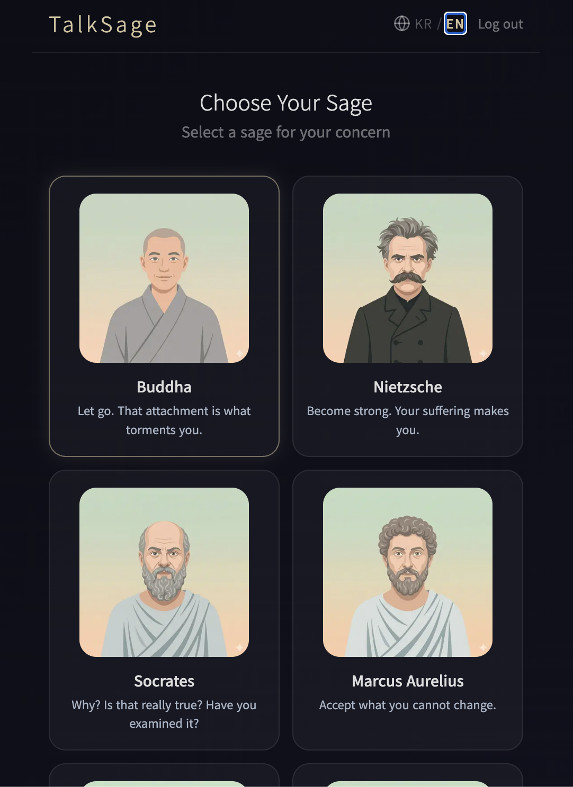
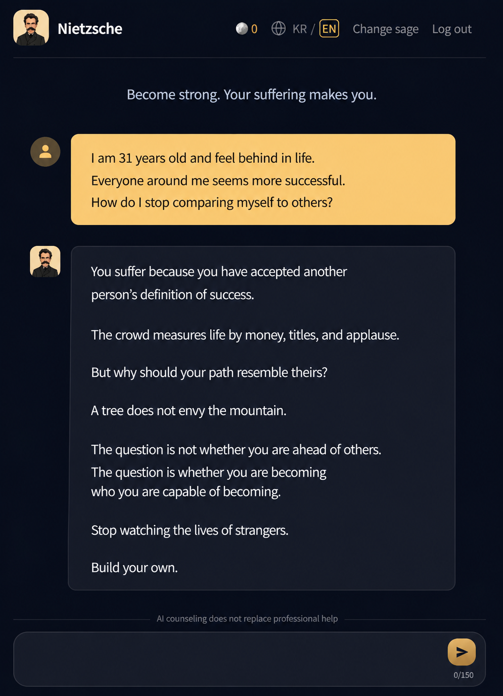

# TalkSage

**AI-powered philosophical counseling with 8 historical philosopher personas**

Get personalized guidance from Socrates, Nietzsche, Marcus Aurelius, and 5 other historical thinkers — each with a distinct voice grounded in their actual philosophical writings via RAG.

<p align="center">
  
  
</p>
---

## Why TalkSage

Most AI chat apps feel generic. TalkSage is different: instead of a single assistant giving one-size-fits-all advice, you choose a philosopher whose worldview resonates with you. Socrates won't give you answers — he'll question you until you find your own. Nietzsche won't comfort you — he'll challenge you to grow. Marcus Aurelius will ask what's actually in your control.

Each persona's responses are grounded in real primary philosophical texts through a RAG pipeline, not just a persona description in a system prompt.

---

## Philosopher Personas

| Persona | Style | Grounding Texts |
|---|---|---|
| **Socrates** | Only asks questions, never answers | Platonic dialogues |
| **Nietzsche** | Challenges, provokes, anti-comfort | Thus Spoke Zarathustra, Beyond Good and Evil |
| **Marcus Aurelius** | Stoic, concise, control-focused | Meditations |
| **Confucius** | Harmony, virtue, social wisdom | Analects |
| **Simone de Beauvoir** | Existential freedom, agency | The Ethics of Ambiguity |
| **Lao Tzu** | Non-action, flow, letting go | Tao Te Ching |
| **Epicurus** | Pleasure, contentment, simplicity | Letters |
| **Montaigne** | Self-reflection, honesty, humor | Essays |

---

## Tech Stack

| Layer | Technology |
|---|---|
| Frontend | Next.js 14, React, Tailwind CSS |
| Backend | Next.js API Routes |
| Database | PostgreSQL via Supabase |
| Vector Search | pgvector (Supabase) |
| AI / LLM | OpenAI API (GPT-4) |
| Auth | Google OAuth via Supabase Auth |
| Deployment | Vercel |

---

## Architecture

```
User query
    │
    ▼
Keyword extraction
    │
    ▼
Vector similarity search (pgvector)
against embedded philosophical texts
    │
    ▼
Top-k passage retrieval
    │
    ▼
Injected into persona system prompt
    │
    ▼
LLM response grounded in primary texts
```

**Key design decision:** Keyword-extraction-based retrieval over pure semantic embedding. Philosophy-specific proper nouns and concepts (e.g., "will to power", "eudaimonia") have better precision with keyword extraction than with semantic-only vector search.

**Conversation management:** Sliding window of last 15 messages sent to the LLM — keeps token cost flat regardless of session length while preserving the most relevant context.

---

## Key Features

- **8 philosopher personas** with distinct, enforced conversational styles
- **RAG pipeline** grounding responses in real philosophical primary texts
- **Google OAuth** authentication
- **Points-based system** — daily grant on login, 1 point per message
- **Conversation history** persisted per user per persona
- **Multi-turn coherence** via sliding window context management

---

## Database Schema

```sql
personas (id, name, slug, system_prompt)
contents (id, persona_id, title, transcript, source_url)
chunks (id, content_id, text, embedding vector(1536))
conversations (id, user_id, persona_id, created_at)
messages (id, conversation_id, role, content)
user_points (id, user_id, points, last_daily_grant)
```

---

## Project Status

Shipped to production. Code is private — this repo contains the README and PRD.

Built solo as a 0-to-1 project to validate the ability to independently design and ship a production AI system with a novel retrieval architecture.

---

## What I Learned

- RAG pipeline design from scratch (chunking strategy, embedding, retrieval, injection)
- Trade-offs between keyword vs. semantic retrieval for domain-specific text
- pgvector schema design and query optimization
- Full-stack product: auth, monetization, session management — all solo
